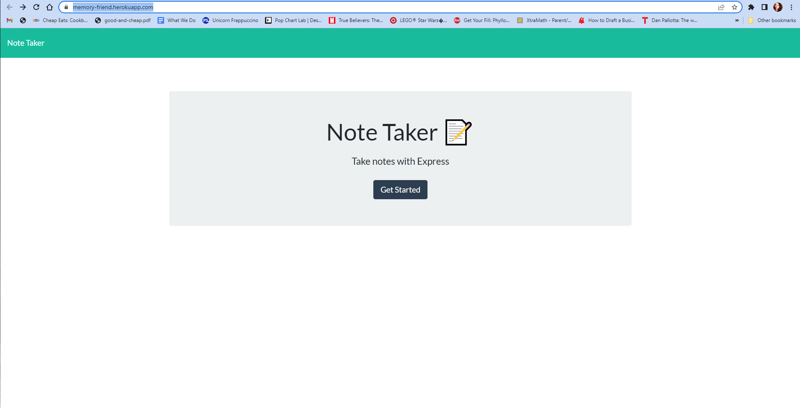

# Note Taker application

  ## Badges
  
    
  

  ## Description
  This application is a simple note taking app that allows the user to store notes on the server, call them up, delete them, and add new ones. 
   

  For my application, I used the following technologies: HTML, CSS, JavaScript, NodeJS, JSON, NPM, Express, Git Bash, GitHub, UUID, and Heroku.
   

  There are a lot of challenges with this application. Mainly the linking of all the files and getting the paths correct. It was difficult getting used to working with a local server and learning the hard way about forgetting to npm start after changes. 
   
  
  In the future, I would like to update the CSS to make it more my own.
    

## Table of Contents
  - [Installation](#installation)
  - [Usage](#usage)
  - [Credits](#credits)
  - [License](#license)
  - [How to Contribute](#how-to-contribute)
  - [Tests](#tests)
  - [Questions](#questions)
    

  ## [Installation](#table-of-contents)
  The website is hosted by Heroku at [Memory Friend](https://memory-friend.herokuapp.com/) 
  You can find the video walkthrough it here: COMING SOON...
    
  The repository is on GitHub: [GitHub repository for README Generator.](https://github.com/jsalexan/note-taker)  
  There you will find following file types: 
   HTML, CSS, JavaScript, JSON, README, Images.
    
  To use the app, you will visit the deployed website on Heroku (coming soon...)    

## [Usage](#table-of-contents)
  The website (link above) was created to be used on the following devices:  
   desktop.  
 
  
    
  
    
  ## [Credits](#table-of-contents) 
  I am grateful for the help of the Panic Problems study (support) group. I also received very helpful assistance on multiple occasions through the AskBCS Learning Assistant feature and my tutor, Patrick Meehan. Last, but not least, I am thankful for the assistance of my UW Full Stack Web Development Bootcamp instructors, teacher assistants, and fellow students, especially Tahlia Bolden.
    

  **Third Party References and Tutorials used include:** 
   
 https://devcenter.heroku.com/ 
 https://developer.mozilla.org/en-US/docs/Web/HTTP/Status/500 
 https://www.npmjs.com/package/uuid 
 https://stackoverflow.com/questions/23259168/what-are-express-json-and-express-urlencoded 
 https://www.geeksforgeeks.org/how-to-build-note-taking-application-using-node-js/?ref=gcse 
 https://expressjs.com/en/guide/routing.html 
 https://devcenter.heroku.com/articles/git 
   

  ## [License](#table-of-contents)
  **MIT** Copyright 2022, Jennifer Alexander 
  [Information about your MIT license.](https://opensource.org/licenses/MIT)
    
  

  ## [How to Contribute](#table-of-contents)
  At this time, I'm not accepting collaborators. Thank you for your interest!
    

  ## [Tests](#table-of-contents)
  N/A
    

  ## [Questions](#table-of-contents)
  If you have any questions or comments, please contact  Jennifer Alexander at jsa.wa.us@gmail.com  or visit my profile at [GitHub](https://github.com/jsalexan/).

  